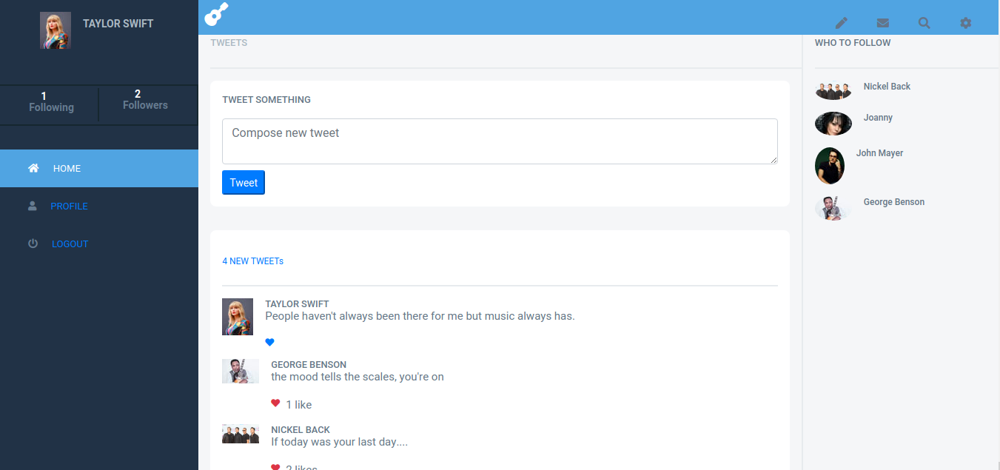
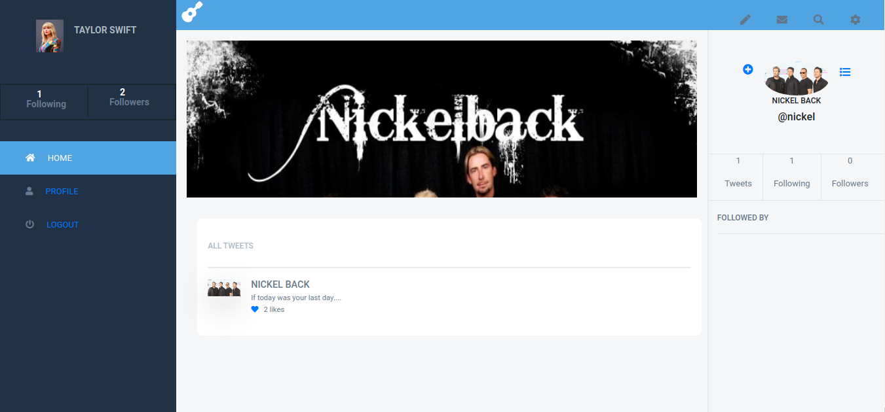

# Music Zone

Capstone projects are solo projects at the end of the each of the Microverse Main Technical Curriculum sections. It is a real-world-like project built with business specifications This project was at the end of the Ruby on Rails curriculum section. For this project, I created an app that allows you to talk about music artist by creating a tweet and various action such as liking a tweet and following another user.

## Live demo

[live demo](https://shielded-oasis-34342.herokuapp.com/login)

- Homepage

- Userpage



## Built With

- Ruby 2.6.2
- Rails 5.2.1
- Sublime
- Bootstrap
- PostgreSQL
- Cloudinary


## Getting Started 

## Prerequisites
In order to make the program work, you need to have ruby interpreter installed in your system. You can get the latest version of ruby from [official website](https://www.ruby-lang.org/en/downloads/).

- Rails: 5.2.4
- Postgres: >=9.5
- Cloudinary

## Install
  To test the Music zone app locally, you will need to:

1. clone the repository

```bash
# Clone this repository
$ git clone https://github.com/ignatius22/music-zone.git

# Go into the repository
$ cd music-zone

# make sure you have ruby 2.7.1
# install gems from Gemfile using bundle
$ bundle install
# create a database

$ rails db:create

# migrate table to database

$ rails db:migrate

# run live server

$ rails server

# run this url on your preffered browser

http://localhost:3000/

# Run test

# to run tests
$ rspec 

##Integration and Unit Test
- Rspec
- Capybara

## Usage

_you can create a user by clicking on the signup button

_You can sign In by clicking on the sign In button

_You can create a tweet when you are logged In by clicking on the `tweet` Button after fill the form

_You can follow a user by clicking the `+` icon next to the name of the user on the

## Authors

👤 **Ignatius Sani**

- Github: [ignatius22](https://github.com/ignatius22)
- Twitter: [@Iggy_code](https://twitter.com/iggy_code)
- Linkedin: [linkedin](https://www.linkedin.com/in/ignatiussani)


## 🤝 Contributing

Contributions, issues and feature requests are welcome!

Feel free to check the <a href="https://github.com/ignatius22/music-zone/issues" target="_blank">issues page</a>.

## Show your support

Give a ⭐️ if you like this project!

## Acknowledgments
 
- <a href="https://www.microverse.org/" target="_blank">Microverse</a>
- <a href="https://www.ruby-lang.org/en/documentation/" target="_blank">Ruby Documentation</a>
- <a href="https://www.behance.net/gallery/19759151/Snapscan-iOs-design-and-branding?tracking_source=" target="_blank">Design Template Gregoire Vella</a>
